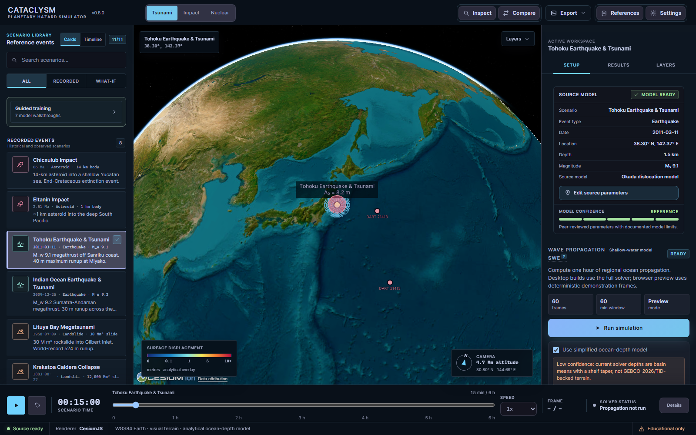
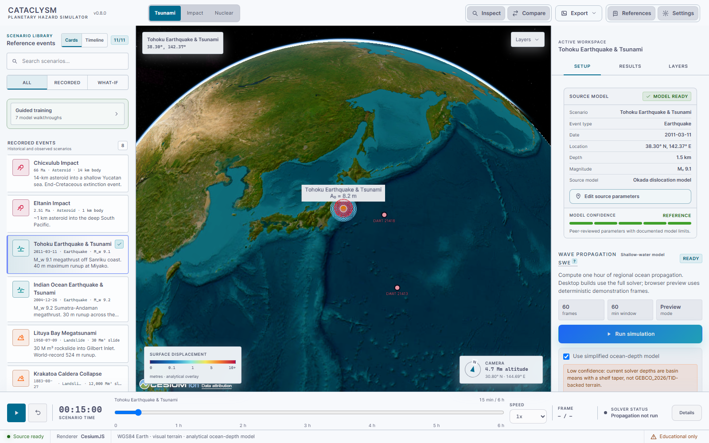

# Cataclysm

[](./CHANGELOG.md)
[](./LICENSE)
[](#install)
[](#architecture)
[](./docs/science)

> A scientifically grounded 3D-globe **multi-hazard disaster simulator**: asteroid impacts (entry, airburst, cratering, thermal/blast), nuclear detonations (fireball, overpressure, thermal, radiation, EMP, fallout, casualties), seafloor earthquakes, subaerial/submarine landslides — and the tsunamis these events generate. Peer-reviewed historical presets span Chicxulub, Tunguska, Chelyabinsk, Hiroshima, Tsar Bomba, Tōhoku 2011, and Lituya Bay 1958.

**Cataclysm** unifies three former projects — **TsunamiSimulator** (its base), **AsteroidSimulator**, and **NukeMap** — into one globe. It began life as "the NukeMap for tsunamis"; it now aims to *be* the NukeMap, the impact simulator, and the tsunami solver at once.

> **Migration status (v0.9.0):** tsunami, asteroid, earthquake, landslide, and nuclear source models are live behind a unified professional simulator workspace. A persistent universal library now previews every tsunami reference event plus complete direct asteroid/nuclear what-if scenarios on the live globe before one explicit Run & Watch action starts physics. Quick Start, recents, favorites, custom creation, and deterministic camera framing stay available across hazard domains. Rust remains the sole authority for direct-effect results, while perceptual gates prevent weak reference frames from being reused as highlight assets. The remaining cinematic rendering work (volumetric fireballs, physically displaced ocean, atmospheric entry, fallout, and inundation) is sequenced in [ROADMAP.md](./ROADMAP.md).

---

## Visual tour



| Light workspace | Categorized settings |
|---|---|
|  |  |

---

## Why this exists

Existing tools each do one piece:

- **[NukeMap](https://nuclearsecrecy.com/nukemap/)** — nuclear airburst effects only, 2D map, no water.
- **[Asteroid Launcher](https://neal.fun/asteroid-launcher/)** — fun, 2D map, no propagating tsunami.
- **[Purdue "Impact: Earth!"](https://impact.ese.ic.ac.uk/ImpactEarth/)** — accurate formulas, single-point readout, no animation.
- **[GeoClaw](http://depts.washington.edu/clawpack/geoclaw/)** / **[COMCOT](https://www.researchgate.net/publication/374553562)** / **[MOST](https://www.pmel.noaa.gov/news-story/first-global-tsunami-simulation-chicxulub-asteroid-impact-66-million-years-ago)** — operational accuracy, Fortran/Python, no consumer UI.

`Cataclysm` combines them: **peer-reviewed source physics + a professional interactive globe workspace**. Pick a source (asteroid, nuke, fault, slide), drop it anywhere on Earth, and watch a shallow-water solution propagate over the app's low-confidence coarse basin/shelf bathymetry, estimate runup at named coastal points, and produce first-order inundation discs. Optional Cesium World Bathymetry improves visual terrain only; it is not the backend solver grid.

---

## Features (current build + roadmap)

### Source models (energy → initial water-surface displacement)

| Source | Status | Reference |
|---|---|---|
| **Asteroid / comet impact** | ✅ formulas wired | Ward & Asphaug 2000 *Icarus* 145:64; Schmidt & Holsapple 1982 |
| **Underwater nuclear** | ✅ formulas wired | Glasstone & Dolan 1977; Le Méhauté 1996; DNA 1996 (5% energy → wave) |
| **Atmospheric / surface nuclear (ocean)** | ✅ formulas wired | Van Dorn et al. 1968; Adams 1972 |
| **"Russia Poseidon" tsunami torpedo** | ✅ realistic mode | Skeptical physics — 360° dispersion, ~5% efficiency |
| **Earthquake (Okada fault dislocation)** | ✅ full Okada I-term wired | Okada 1985; Mansinha & Smylie 1971 |
| **Subaerial landslide** | ✅ Heller–Hager 2D channel | Fritz & Hager 2001 (Lituya); Slingerland & Voight |
| **Submarine landslide** | ✅ Watts 2003 best-fit | Watts et al. 2005 |
| **Volcanic caldera collapse** | 🔲 planned | Krakatoa 1883, Hunga Tonga 2022 |

### Propagation

- ✅ **Linear long-wave** (deep-ocean, fast preview).
- ✅ **Shallow-water equations** — depth-averaged 2D leapfrog with `rayon`
  row-parallel updates, Manning bottom friction, CFL-safe Δt, snapshots
  rendered as PNG overlays on the Cesium globe.
- 🔲 **Boussinesq** for dispersive waves (impact-tsunami wavelengths shorter than ocean depth — important for Ward–Asphaug regime).
- 🔲 **Adaptive mesh refinement** (AMR) like GeoClaw — coarse far-field, fine coastal.
- ✅ **GPU compute** via `wgpu` behind the `gpu` feature flag, with CPU fallback when no adapter is available.

### Coastal inundation

- ✅ **Synolakis 1987 runup law** sampled at 60+ named coastal points,
  rendered as colour-graded 3D bars on the globe.
- 🔲 **MOST-style wetting/drying** on bathymetric grid.
- ✅ **First-order inundation discs** from runup/slope estimates.
- 🔲 **Real flood polygons** rendered as GeoJSON overlays on Cesium.

### Presets (historical events with peer-reviewed parameters)

| Event | Date | Source type | Magnitude | Peak wave | Reference |
|---|---|---|---|---|---|
| **Chicxulub impact** | 66 Ma | Asteroid, 14 km dia | ~10⁸ Mt TNT | 4.5 km initial, 1.5 km @ 220 km | Range et al. 2022 *AGU Adv* |
| **Tōhoku** | 2011-03-11 | M 9.1 megathrust | — | 40 m runup | Mori et al. 2011 |
| **Indian Ocean** | 2004-12-26 | M 9.2 megathrust | — | 30 m runup, 230k dead | Synolakis et al. 2005 |
| **Lituya Bay** | 1958-07-09 | Rockslide, 30 M m³ | M 7.8 trigger | **524 m runup** | Fritz et al. 2001 |
| **Krakatoa** | 1883-08-27 | Caldera collapse | VEI 6 | 42 m | Choi et al. 2003 |
| **Storegga slide** | ~8150 BP | Submarine slide, 3000 km³ | — | 20 m+ in Scotland | Bondevik et al. 2005 |
| **Hunga Tonga** | 2022-01-15 | Submarine volcano | VEI 5–6 | 15 m local + atmospheric Lamb wave | Carvajal et al. 2022 |
| **Eltanin** | 2.51 Ma | Asteroid, ~1 km dia | South Pacific | Globally significant | Gersonde et al. 1997 |
| **Hypothetical Cumbre Vieja** | — | Flank collapse (La Palma) | 500 km³ scenario | Disputed; 5–25 m E coast US | Ward & Day 2001 (controversial) |
| **"Poseidon" deployment** | — | 100 Mt underwater | — | ~1–5 m at 100 km (realistic) | DNA 1996, Glasstone 1977 |
| **Kamchatka** | 2025-07-29 | M 8.8 megathrust | — | 0.85 m at DART 21416 (2nd-largest ever recorded) | USGS us6000qw60; NCTR |
| **Sanriku (Miyako)** | 2026-04-20 | M 7.4 thrust | — | modest; warning in 17 min | USGS us6000sri7; NCTR |
| **Lisbon** | 1755-11-01 | M ~8.7 thrust | — | trans-Atlantic | Barkan et al. 2009 |
| **Amorgos** | 1956-07-09 | M 7.7 normal fault | — | 30 m local (landslide-driven) | Okal et al. 2009 |
| **Anak Krakatau** | 2018-12-22 | Flank collapse, 0.27 km³ | — | ~50 m near volcano | Grilli et al. 2019 |
| **2024 YR4 what-if** | — | Asteroid, 60 m (impact ruled out) | ~7.7 Mt | myth-busting upper bound | NASA/JWST |

### UX

- **Desktop-first professional simulator workspace** — persistent scenario
  library, dominant globe viewport, Setup / Results / Layers inspector, and a
  full-width simulation transport with playback speed and solver state.
- **Focused command bar** — mode switching, inspect/compare tools, grouped
  exports, references, and settings without a wall of equal-priority buttons.
- **Scenario library filters** — recorded and what-if cases stay searchable,
  while guided training remains available without crowding the primary flow.
- **5 globe styles**: high-detail Esri World Imagery by default, bundled Natural
  Earth II as the deterministic offline fallback, OpenStreetMap, Cesium World
  Imagery, and Cesium World Bathymetry.
- **Enforced Earth source contracts** — every integrated imagery, terrain, and
  ocean input has version, license, attribution, datum, resolution, integrity,
  quality-tier, and use-rights metadata. Settings exposes the active source
  contract; diagnostics include the provider/asset inventory; media export
  fails closed when required live attribution is unavailable.
- **Shared geodesy and surface contract** — WGS84 geographic/ECEF coordinates,
  local Unreal-style ENU centimetres, vertical-axis direction, CRS/datum, and
  declared error budgets travel with solver height fields and exports. One
  versioned mask drives solver wet/dry cells and picked asteroid/nuclear target
  response; ambiguous coast cells preserve the operator's material choice.
- **Scenario builder** — tabbed Asteroid / Nuclear / Earthquake / Landslide
  forms; click-globe-to-pick location.
- **Timeline scrubber + SWE playback** — scrub a 24-frame snapshot sequence
  through the live shallow-water solver, with classic or colorblind-safe
  overlay colormaps.
- **Effect overlays** — wavefront ring, coastal runup bars at 60+ named
  coastal points, DART buoy historical observations with per-buoy
  model-vs-observed RMSE for the four instrumented presets.
- **Max-field products** — fgmax-style peak-amplitude, time-of-maximum, and
  energy-directivity overlays for every solver run, plus labelled
  first-arrival isochrones (NOAA travel-time-map style) exportable as
  GeoJSON.
- **Teacher mode** — lockable classroom settings profiles (via settings
  export/import) and a printable worksheet for each of the 7 guided lessons.
- **Side-by-side comparison mode** — two scenarios on synchronised globes.
- **Catppuccin Mocha** dark theme default + **Latte** light theme toggle.

### Renderer quality budgets

Visual quality is independent of the authoritative Rust solver field. Automatic
performance protection watches rolling P95 frame time, steps down one tier only
after sustained pressure, and recovers with hysteresis; it never changes solver
ticks, event times, eta/velocity fields, or analytical overlays.

| Tier | Target viewport | Target | GPU memory | Visual budget highlights |
|---|---:|---:|---:|---|
| Low | 1280 x 720 | 60 FPS | 512 MB | 0.75 render scale, 1x MSAA, no volumetrics/reflections |
| Medium | 1920 x 1080 | 60 FPS | 1 GB | 2x MSAA, 24 volumetric samples, 30k particles |
| High | 2560 x 1440 | 60 FPS | 2 GB | 4x MSAA, terrain shadows, AO, 80k particles |
| Cinematic | 3840 x 2160 | 30 FPS | 4 GB | 8x MSAA, bloom, 96 volumetric samples, 200k particles |

The hardware gate is measured in headless Chrome/ANGLE D3D11 on Windows 11
build 26100, Intel Core Ultra 9 285, NVIDIA GeForce RTX 4070 SUPER, driver
32.0.15.9579. Run `npm run benchmark:renderer`; it rejects software rendering
and writes adapter plus frame-time evidence to
`artifacts/performance/renderer-benchmark.json`.

---

## Install

Prebuilt Windows installers for the latest release are on the
[Releases page](https://github.com/SysAdminDoc/Cataclysm/releases):
an MSI package and an NSIS setup executable. The v0.9.0 Windows installers are
locally built from this repository and are currently unsigned until a Windows
code-signing certificate is configured, so Windows may show an unknown-publisher
warning. macOS and Linux remain supported source-build targets; platform
installers for those systems should be produced locally on those platforms when
signing/build hosts are available.

**Verify your download** — each release includes a `checksums-sha256.txt` file.
Compare the SHA256 of the downloaded file to the published value:

```powershell
# PowerShell
(Get-FileHash .\Cataclysm_0.9.0_x64_en-US.msi -Algorithm SHA256).Hash
```

```cmd
:: Command Prompt
certutil -hashfile Cataclysm_0.9.0_x64_en-US.msi SHA256
```

See [`docs/release/CODESIGNING.md`](./docs/release/CODESIGNING.md) for full
verification details and the maintainer release checklist.

The app starts with high-detail **Esri World Imagery** and automatically falls
back to bundled **Natural Earth II** when offline or when the provider fails, so
the simulator remains usable without network tiles or a token. OpenStreetMap is
another no-token online option, and a free Cesium ion token unlocks optional
streamed imagery and visual bathymetric terrain from Settings. Provider terms,
attribution, spatial metadata, and rights-review dates are visible beside the
selected Earth source.
Solver bathymetry remains the app's low-confidence coarse basin/shelf
approximation until the blocked GEBCO_2026/TID-backed local data path is
resolved.

The bundled surface mask is intentionally coarse and declares a 550 km worst-
case horizontal error. It is a consistency contract, not a shoreline product.
Three official NOAA GEOID18 coastal fixtures validate ellipsoid/orthometric
conversion and Cesium/Rust/Unreal coordinate agreement; arbitrary geoid or tide-
datum conversion fails closed until the required model grid is supplied.

### Build from source

Prerequisites:

- **Node.js** ≥ 20 LTS
- **Rust** ≥ 1.88 (stable) with `rustup`
- Windows: Visual Studio 2022/2026 with "Desktop development with C++"
  workload (provides MSVC `link.exe`); WebView2 runtime (preinstalled on Win11)
- macOS: Xcode Command Line Tools
- Linux: `libwebkit2gtk-4.1-dev`, `libgtk-3-dev`,
  `libayatana-appindicator3-dev`, `librsvg2-dev`, `libsoup-3.0-dev`

The Tauri CLI ships via the `@tauri-apps/cli` npm dev dependency — no
separate `cargo install` step.

```bash
git clone https://github.com/SysAdminDoc/Cataclysm
cd Cataclysm
npm install
npm run doctor             # local toolchain preflight with actionable fixes
npm run dev                # browser preview with deterministic demo data
npm run tauri dev          # full desktop app with Rust/Tauri IPC
npm run verify             # local type/lint/test/audit/build verification gate
npm run verify:release     # strict default/GPU/validation Rust matrix + policy gate
npm run verify:render-protocol # independent binary replay and ECEF conformance gate
npm run capture:references # regenerate 12-scene 1440p/4K visual candidates + telemetry
npm run verify:highlight-assets -- --scene orbit-global --resolution 1440p # require opener/thumbnail quality
npm run tauri:build        # verified GPU-enabled installer(s) + signed artifact manifest
```

The browser preview is for deterministic shell and globe development. Direct
asteroid and nuclear calculations require the desktop app so the frontend
cannot diverge from the Rust scientific authority.

`tauri:build` runs the strict gate, deletes stale bundles, compiles the desktop
binary with GPU support, performs a non-visual capability smoke, and writes
`src-tauri/target/release/bundle/cataclysm-build-manifest.json` with the enabled
Cargo features and SHA-256 digest of every platform artifact. Systems without a
supported adapter continue through the existing CPU fallback instead of losing
simulation capability.

The strict release gate also renders 24 unmasked, offline-safe reference frames
from fixed scenario/time/effect/camera seeds. Candidate PNGs and telemetry are
written under ignored `artifacts/visual-reference/`; the tracked hash locks are
validated by `npm run verify:reference-locks`. A visual change is approved one
frame at a time, for example:

```bash
npm run approve:reference -- --scene orbit-global --resolution 1440p --approve orbit-global@1440p --reason "Reviewed atmosphere change"
```

Wildcard, multi-frame, mismatched, and reason-free approvals fail before
rendering. Browser-only direct-effect reference frames consume tracked binary
recordings serialized by Rust and decoded through the same protocol client.

Each reference scene also declares its subject, event phase, target region,
required scale cue, forbidden failure cues, and perceptual thresholds in
`src/data/reference-visual-quality.json`. Event scenes emit labelled
Before / Event / Aftermath review sheets. A stable analytical baseline may be
explicitly blocked from highlight use; `verify:highlight-assets` fails unless
both the metrics and the dated human review approve that exact scene for the
launch opener, scenario thumbnails, or other promotional presentation.

To bake a Cesium ion token at build time, `cp .env.example .env` and paste
it in; otherwise leave it blank and paste at runtime in **Settings**.

---

## Architecture

```
┌─────────────────────────── Tauri 2 Window ───────────────────────────┐
│ ┌─────────────────────────────────────────────────────────────────┐  │
│ │  React 19 + TypeScript + Vite (frontend / WebView2)             │  │
│ │  ─ CesiumJS 1.143+ globe with optional bathymetric terrain        │  │
│ │  ─ Scenario builder, timeline, overlays, results panel           │  │
│ └──────────────────────────────  ▲  ───────────────────────────────┘  │
│                                  │ tauri::invoke (JSON over IPC)      │
│ ┌──────────────────────────────  ▼  ───────────────────────────────┐  │
│ │  Rust backend (src-tauri/)                                       │  │
│ │  ─ physics::asteroid    Ward–Asphaug + Schmidt–Holsapple         │  │
│ │  ─ physics::nuclear     Glasstone–Dolan + Le Méhauté             │  │
│ │  ─ physics::landslide   Fritz–Hager + Slingerland–Voight         │  │
│ │  ─ physics::earthquake  Okada 1985 (full I-term)                  │  │
│ │  ─ physics::shallow_water  NSWE + Synolakis runup                │  │
│ │  ─ data::bathymetry     coarse basin/shelf depth sampler         │  │
│ │  ─ presets              Chicxulub / Tōhoku / Lituya / …          │  │
│ └──────────────────────────────────────────────────────────────────┘  │
└───────────────────────────────────────────────────────────────────────┘
```

Physics runs in the Rust backend (multi-threaded via `rayon`, GPU via `wgpu`
behind the `gpu` feature flag). Renderer protocol v1 streams checksummed raw
SWE fields, authoritative ticks, typed hazard events, and georeferenced ENU/ECEF
transforms over Tauri raw channels. Cesium decodes and presents those packets;
future renderers replay the same bytes without reimplementing physics. The
legacy SWE PNG channel remains temporarily for analytical color overlays.

---

## The science (and its limits)

This is not a forecast tool. Compared to operational models like NOAA MOST:

- **What's accurate** — initial conditions (cavity geometry from Ward–Asphaug, fault displacement from Okada), idealized open-ocean propagation in deep water, far-field arrival times.
- **What's approximate** — solver bathymetry (coarse basin means with a shelf taper, not GEBCO_2026/TID-backed terrain), coastal runup (we use Synolakis 1987 analytical instead of full wetting/drying), first-order inundation discs, dispersion (linear long-wave first, Boussinesq later).
- **What's wrong** — anything involving the atmosphere coupling (Hunga Tonga–style Lamb-wave coupling is a research frontier), tsunami earthquake source-time functions (we use static dislocation), submarine landslide rheology.
- **The "Russia Poseidon" honest take** — Russian state media's 500-m-wave claim is propaganda. The 1996 Defense Nuclear Agency study put underwater-explosion wave-generation efficiency at ~5%. A 100-Mt warhead at 100 km open ocean produces a ~few-meter wave, not a city-killer. We model both the propaganda yield and a realistic one — the comparison is the point.

See [`docs/science/`](./docs/science) for formula derivations and citations.

---

## References (anchors, full list in `docs/science/REFERENCES.bib`)

- Ward, S. N., & Asphaug, E. (2000). Asteroid impact tsunami: a probabilistic hazard assessment. *Icarus*, 145, 64–78.
- Range, M. M., et al. (2022). The Chicxulub Impact Produced a Powerful Global Tsunami. *AGU Advances*. https://doi.org/10.1029/2021AV000627
- Synolakis, C. E. (1987). The runup of solitary waves. *J. Fluid Mech.*, 185, 523–545.
- Okada, Y. (1985). Surface deformation due to shear and tensile faults in a half-space. *BSSA*, 75, 1135–1154.
- Fritz, H. M., Hager, W. H., & Minor, H.-E. (2001). Lituya Bay case: rockslide impact and wave run-up. *Sci. Tsunami Hazards*, 19, 3–22.
- Glasstone, S., & Dolan, P. J. (1977). *The Effects of Nuclear Weapons* (3rd ed.). USDOE.
- Le Méhauté, B., & Wang, S. (1996). *Water Waves Generated by Underwater Explosion*. World Scientific.
- Collins, G. S., Melosh, H. J., & Marcus, R. A. (2005). Earth Impact Effects Program. *Meteoritics & Planetary Science*, 40, 817–840.
- Berger, M. J., George, D. L., LeVeque, R. J., & Mandli, K. T. (2011). The GeoClaw software for depth-averaged flows. *Advances in Water Resources*, 34(9), 1195–1206.

---

## Roadmap & research

- [`ROADMAP.md`](./ROADMAP.md) — phased delivery plan (v0.1.0 → v1.0.0).
- [`CHANGELOG.md`](./CHANGELOG.md) — shipped feature summary.

## License

[MIT](./LICENSE). For scientific education and hazard-awareness visualization only. Not for evacuation planning. Use NOAA NTWC/PTWC for real warnings.

## Author

[@SysAdminDoc](https://github.com/SysAdminDoc) — Senior Systems Administrator, medical-imaging IT, side projects in physics-based simulators.
