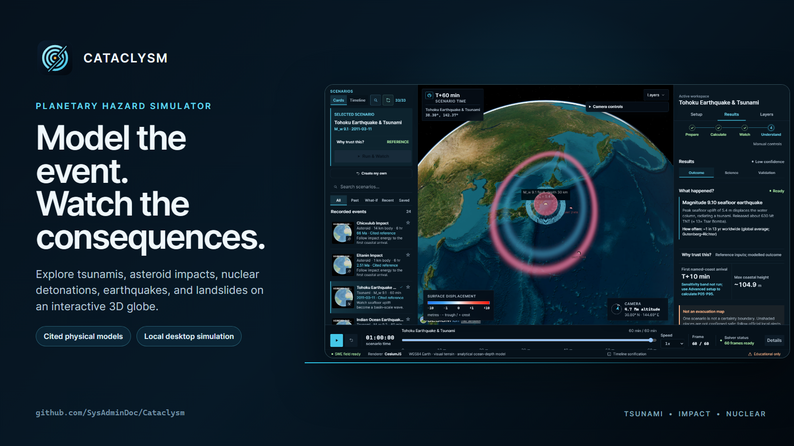
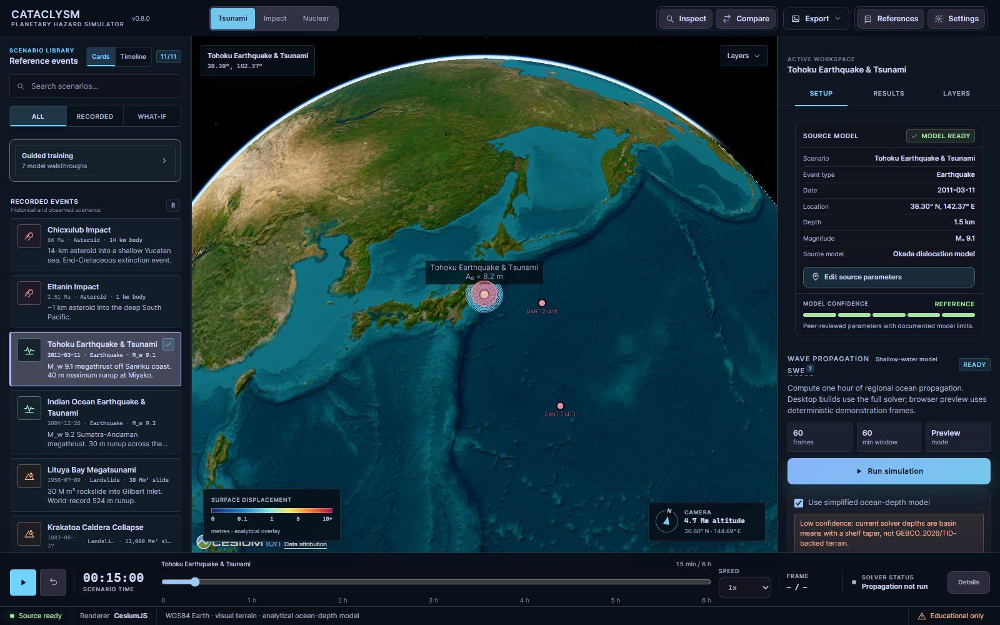
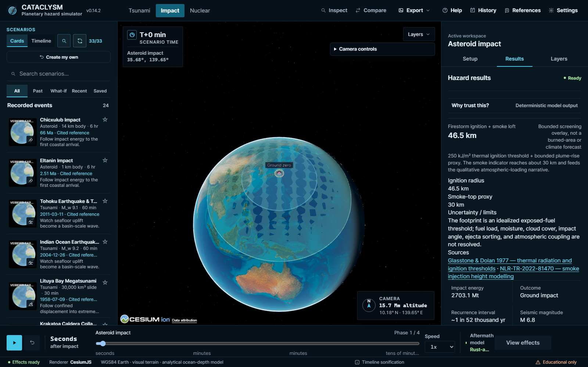
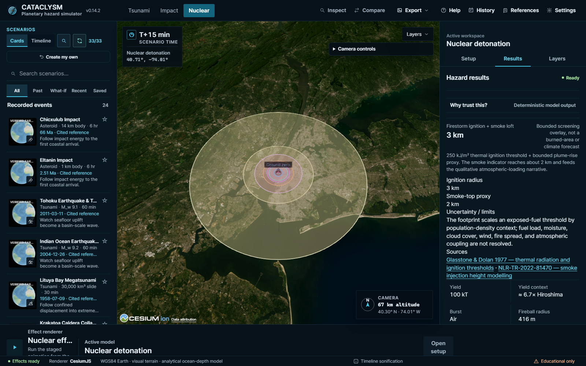
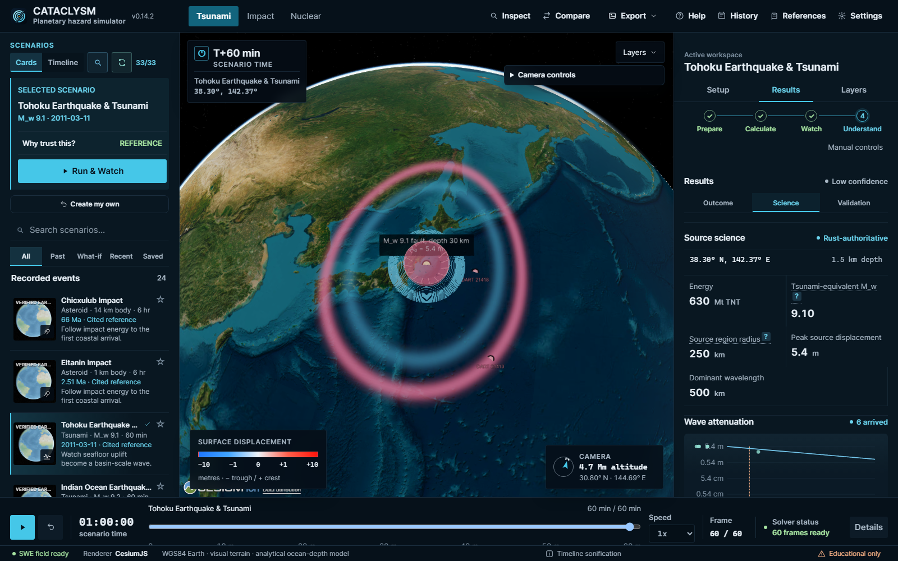

# Cataclysm

[](./CHANGELOG.md)
[](./LICENSE)
[](#install-cataclysm)
[](#architecture)
[](#model-boundaries)

Cataclysm is a local-first desktop simulator for planetary hazards. Recreate a documented event or build a what-if scenario, then watch the modeled effects unfold on a 3D globe.

It brings tsunami propagation, asteroid impacts, nuclear detonations, earthquakes, landslides, and volcanic collapse into one inspectable workspace. Results keep their assumptions, model references, data identity, and uncertainty notes close at hand.

**[Download Cataclysm v0.14.2 for Windows](https://github.com/SysAdminDoc/Cataclysm/releases/latest)**

> Cataclysm is an educational and research tool. It is not a forecast, warning, evacuation map, weapons-effects authority, or personal safety guide.

## See it in action

### Follow a tsunami from source to coast

Choose a historical event, run the model, and move through its outcome on the same timeline and globe.



### Move between planetary hazards

The same workspace handles direct-effect models without sending you to a separate app.

| Asteroid impact | Nuclear airburst |
|---|---|
|  |  |

### Inspect the science behind a result

Inputs, units, derived values, citations, and known limits remain visible beside the map.



## What you can model

- **Tsunamis:** seafloor earthquakes, asteroid ocean impacts, landslides, caldera collapse, meteotsunamis, and underwater nuclear sources.
- **Asteroid impacts:** atmospheric entry, breakup or airburst, cratering, thermal exposure, blast, ejecta, seismic effects, and cited long-term aftermath screening where applicable.
- **Nuclear detonations:** fireball, blast overpressure, thermal exposure, prompt radiation, fallout, EMP, and bounded casualty-model comparisons.
- **Coastal outcomes:** basin propagation, first arrival, named-coast runup, gauges, inundation screening, DART comparisons, and exportable scientific fields.

The built-in library includes Tohoku 2011, Chicxulub, Lituya Bay 1958, the 2004 Indian Ocean tsunami, Tunguska, Chelyabinsk, Hiroshima, and Tsar Bomba. Recorded source inputs stay separate from modeled outcomes.

## A result you can question

Cataclysm is designed to show its work.

| Capability | What it gives you |
|---|---|
| Source-aware results | The governing model, input values, units, assumptions, citations, and visible limits for the selected effect. |
| Rust-authoritative physics | Desktop calculations for source conditions, direct effects, shallow-water propagation, inspection, and scientific export. |
| Reproducible runs | Local run history with input and data digests, quality evidence, replay frames, reruns, and side-by-side comparison. |
| Portable workspaces | `.cataclysm` packages reopen the scenario and its exact globe view before you run or share it. |
| Export paths | JSON, CSV, GeoJSON, NetCDF, Zarr, VTK, GeoPackage, screenshots, and portable `.cataclysm` scenarios where applicable. |

No account is required. Run archives, settings, imported data, and cached scientific results stay on the machine.

## How it works

1. Pick a recorded scenario or create one from asteroid, nuclear, earthquake, landslide, or meteotsunami inputs.
2. Select **Run & Watch**. Cataclysm prepares the source, calculates the result, plays the timeline, and opens the outcome.
3. Move between Outcome, Science, Validation, and Layers without losing the active scenario.
4. Inspect a point, compare runs, or export the result with its provenance.

Simple mode keeps the main journey focused. Customize exposes a smaller set of understandable controls. Advanced mode opens exact grids, gauges, sensitivity tools, solver settings, and scientific diagnostics.

## Model boundaries

Cataclysm is honest about what a desktop model can and cannot establish.

- Initial conditions use published formulations including Ward and Asphaug, Okada, Glasstone and Dolan, Collins and colleagues, and source-specific landslide work.
- Tsunami propagation uses linear long-wave previews and a well-balanced, positivity-preserving shallow-water solver. GPU compute has a CPU fallback.
- Coastal runup uses analytical screening at named points. Default bathymetry is a low-confidence coarse basin and shelf approximation unless the user supplies a validated local raster.
- Inundation discs, casualty ranges, firestorm footprints, fallout, long-term asteroid aftermath, and related direct effects are bounded screening products. They are not operational predictions.

Atmospheric coupling, detailed shoreline flooding, source-time history, complex landslide rheology, and local building response need higher-resolution specialist models and better site data. Cataclysm labels these limits in the interface and exports.

For real tsunami warnings, use the official NOAA National Tsunami Warning Center or Pacific Tsunami Warning Center.

## Install Cataclysm

### Windows

The v0.14.2 Windows installers are available on [GitHub Releases](https://github.com/SysAdminDoc/Cataclysm/releases/latest). Standard MSI and NSIS packages are the smallest option. Separately labeled offline installers include the WebView2 Evergreen installer for machines that do not already have it.

Releases are built locally and are currently unsigned. Windows may show an unknown-publisher warning. Each release includes SHA256 checksums, CycloneDX software bills of materials, and build provenance.

```powershell
(Get-FileHash .\Cataclysm_0.14.2_x64_en-US.msi -Algorithm SHA256).Hash
```

Compare that value with `checksums-sha256.txt` from the same release.

### macOS and Linux

The source supports Tauri targets on macOS and Linux. Prebuilt packages are not currently published for those platforms, so build from source on the target system.

## Build from source

You will need Node.js 20 or newer and Rust 1.91 or newer. Windows builds also need the Visual Studio C++ workload. Tauri lists the required WebKit and GTK packages for Linux, while macOS needs Xcode Command Line Tools.

```bash
git clone https://github.com/SysAdminDoc/Cataclysm.git
cd Cataclysm
npm ci
npm run doctor
npm run tauri dev
```

The browser preview uses checked-in WebAssembly compiled from the same Rust source-model code:

```bash
npm run dev
```

Before packaging a change, run the local gates:

```bash
npm run verify
npm run verify:release
npm run tauri:build
```

`npm run tauri:build` clears stale bundles, builds the GPU-enabled desktop app with CPU fallback, and produces standard plus WebView2-offline Windows installers. See [unsigned release details](./docs/release/UNSIGNED_RELEASES.md) for the verification and packaging policy.

## Command-line use

The Rust CLI can validate and run a scenario without the desktop interface:

```bash
cargo build --release --manifest-path src-tauri/Cargo.toml --bin cataclysm-cli
src-tauri/target/release/cataclysm-cli validate --input scenario.json
src-tauri/target/release/cataclysm-cli run --input scenario.json --output run.json --data-dir ./cataclysm-data
src-tauri/target/release/cataclysm-cli inspect --result run.json --lat 38.3 --lon 142.37 --data-dir ./cataclysm-data
```

Run `cataclysm-cli --help` for resume, comparison, scientific export, benchmark, and GeoPackage commands.

## Earth imagery, data, and privacy

The default view uses Esri World Imagery and falls back to bundled Natural Earth II data when the network is unavailable. OpenStreetMap is available without a token. A Cesium ion token can enable additional imagery and visual terrain.

Terrain changes presentation only. It does not alter a solver field. Desktop users can import a local WGS 84 GeoTIFF or NetCDF-CF depth or elevation raster after a strict metadata preflight.

Cataclysm has no telemetry. Online map providers receive the normal tile request for the visible map. The optional humanitarian-facilities layer is off by default and sends only bounded map extents to OpenStreetMap Overpass when enabled.

## Architecture

| Layer | Technology | Responsibility |
|---|---|---|
| Desktop shell | Tauri 2 | Native window, files, secure local storage, notifications, and packaging |
| Interface | React 19 and TypeScript | Scenario workflow, timeline, inspectors, accessibility, and exports |
| Globe | CesiumJS | Earth imagery, camera, analytical overlays, comparison, and picking |
| Model core | Rust | Source physics, direct effects, shallow-water solver, validation, and scientific formats |
| Browser model | Rust to WebAssembly | Source and direct-effect calculations in the PWA and browser preview |

The desktop backend streams checksummed fields and typed events to the interface. Cesium presents those values without becoming a second physics implementation.

## Science and documentation

Formula notes and the full bibliography live in [`docs/science`](./docs/science). Useful starting points include:

- Ward, S. N., and E. Asphaug. *Asteroid impact tsunami: a probabilistic hazard assessment*. Icarus, 2000.
- Synolakis, C. E. *The runup of solitary waves*. Journal of Fluid Mechanics, 1987.
- Okada, Y. *Surface deformation due to shear and tensile faults in a half-space*. BSSA, 1985.
- Glasstone, S., and P. J. Dolan. *The Effects of Nuclear Weapons*. US Department of Defense and US Department of Energy, 1977.
- Range, M. M., and colleagues. [The Chicxulub Impact Produced a Powerful Global Tsunami](https://doi.org/10.1029/2021AV000627). AGU Advances, 2022.
- Collins, G. S., H. J. Melosh, and R. A. Marcus. *Earth Impact Effects Program*. Meteoritics & Planetary Science, 2005.

More project material:

- [Changelog](./CHANGELOG.md)
- [Roadmap](./ROADMAP.md)
- [Citation metadata](./CITATION.cff)
- [Release verification policy](./docs/release/UNSIGNED_RELEASES.md)

## License

Cataclysm is released under the [MIT License](./LICENSE).
